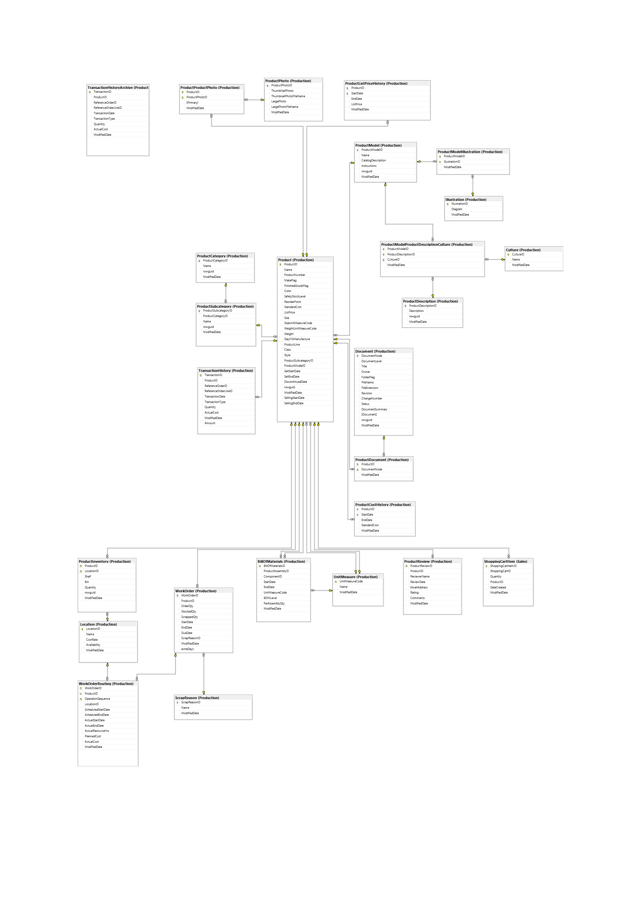

# Unraveling AdventureWorks: A Deep Dive into Production Analytics

## Overview
This project is an in-depth SQL-based analysis of the **AdventureWorks2017** production database. It covers various aspects of **product management, inventory, work orders, sales transactions, pricing history, and bill of materials**. The queries provide insights into different entities within the production line and facilitate data-driven decision-making.

## Repository Contents

- **`queries.sql`** - Contains all the SQL queries used for analysis.
- **`production_line_diagram.png`** - Entity-Relationship Diagram (ERD) showcasing table relationships.
- **`README.md`** - Documentation for the project.

## Key Analyses & Insights
### **Data Cleaning & Transformation**
- Converted `SellStartDate` and `SellEndDate` to proper `DATE` format.
- Identified that `DiscontinuedDate` is NULL for all products, meaning no product was discontinued.

### **Product Hierarchy & Categorization**
- Analyzed the relationships between **Products, Subcategories, and Categories**.
- Used `PIVOT` operations to display category-wise product counts in a readable format.
- Identified **209 products** with no subcategory assigned.

### **Inventory Management**
- Counted total available stock per product.
- Identified **72 products** that do not have inventory.
- Assessed safety stock levels and identified products needing **restocking**.

### **Work Order & Production Efficiency**
- Identified **238 products** with active work orders.
- Found top **10 most ordered products**.
- Calculated the **scrap rate** and categorized loss levels (`HIGH LOSS`, `MEDIUM LOSS`, etc.).
- Evaluated production efficiency based on **work order completion times**.

### **Product Pricing Analysis**
- Tracked **historical price changes** using `LAG()` and rolling differences.
- Identified products with the **highest price hikes**.
- Performed similar **cost price history analysis**.

### **Sales & Transaction Insights**
- Analyzed **transaction types (Work Order, Sales Order, Purchase Order)**.
- Found **total revenue generated from product sales**.
- Evaluated the **profitability of shopping carts**.

### **Product Reviews & Customer Insights**
- Extracted **most-reviewed products** and their **average ratings**.
- Implemented rolling averages for customer review trends.

### **Bill of Materials & Component Analysis**
- Found **total components in each product assembly**.
- Evaluated the **number of discontinued components**.
- Assessed **total quantity required** for each parent product.

## Technologies Used
- **Microsoft SQL Server** (T-SQL)
- **AdventureWorks2017 Database**
- **Entity-Relationship Modeling (ERD)**
- **SQL Optimization Techniques**

## ERD Representation
The **production line diagram** showcases how tables in the AdventureWorks2017 database are related. This helps in understanding how data is structured and queried efficiently.



## How to Use
1. Clone the repository:
   ```sh
   git clone https://github.com/yourusername/AdventureWorks2017-Production-Analysis.git
   ```
2. Open **Microsoft SQL Server Management Studio (SSMS)**.
3. Run the SQL queries in `queries.sql` against the **AdventureWorks2017** database.
4. Analyze the outputs and tweak queries for further insights.

## Key Learnings
- **Advanced SQL techniques**: `PIVOT`, `ROW_NUMBER()`, `LAG()`, `WITH CTE`.
- **Data cleansing & transformation**.
- **Inventory & production efficiency analysis**.
- **Historical price & cost trend analysis**.
- **Sales and profitability evaluation**.

## Future Enhancements
- Integrate **Power BI/Tableau** for visualization.
- Automate data reporting for stakeholders.
- Implement **stored procedures** for efficiency.   
